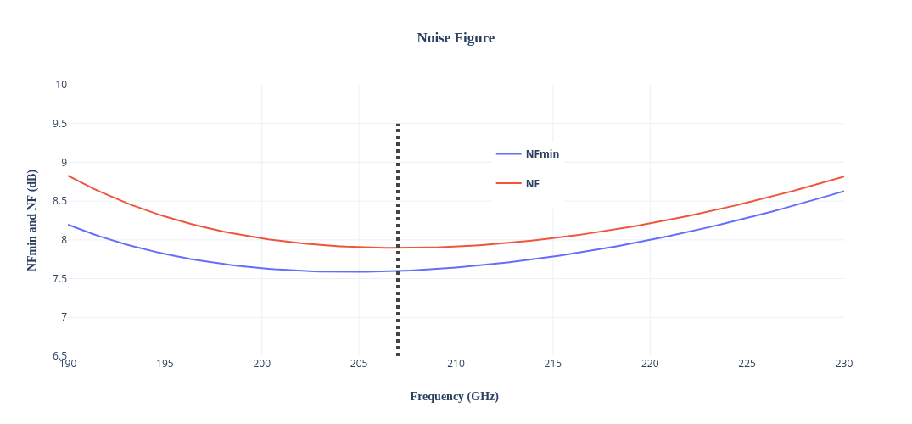
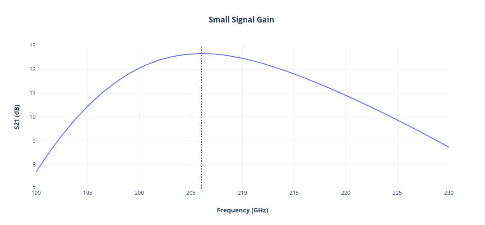
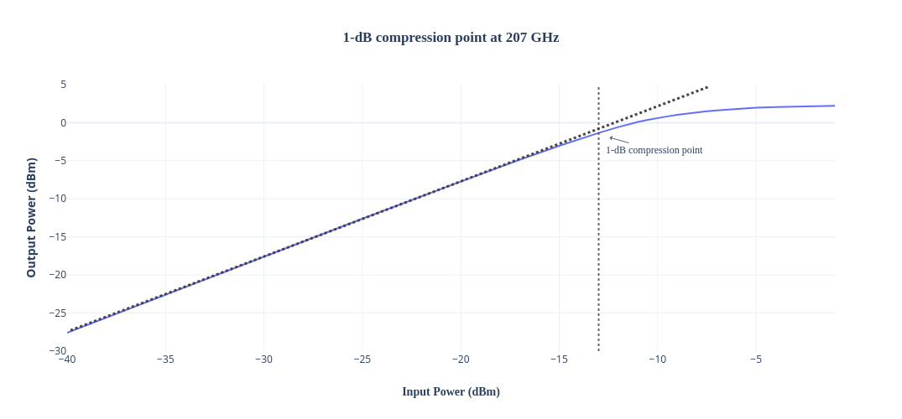

Design data and design process description
############################################

Schematic: Qucs-s 25.1.2

Simulator: Ngspice 44

**Simulated Noise Figure(NF) and Minimimum Noise Figure (NFmin):**

The Noise Figure (NF) is close to the Minimum Noise Figure (NFmin).

**Simulated Small Signal Gain (S21):**

**Simulated 1-dB compression point at 207 GHz:**

