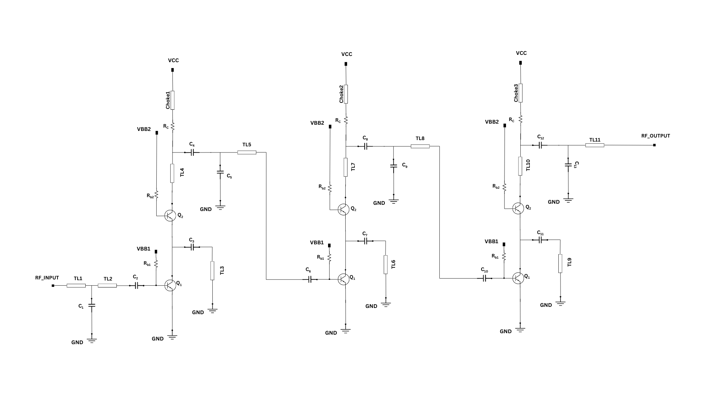

A Cascode Low Noise Amplifier at 160GHz 
###################################################

 
**Schematic:**

.. list-table:: **DC Voltages**
   :widths: 200 200 200
   :header-rows: 1

   * - VCC
     - VBB1
     - VBB2
   * - 2.7 V
     - 0.96 V
     - 2.31 V

.. list-table:: **HBT Parameter**
   :widths: 200 200 
   :header-rows: 1

   * - HBT
     - Multiplier
   * - Q1
     - 2
   * - Q2
     - 10
   

.. list-table:: **Capacitor Values**
   :widths: 200 100 200 100
   :header-rows: 1

   * - Parameter
     - Type
     - Length 
     - Width
   * - C\ :sub:`1`
     - rfcmim
     - 2.8 um
     - 4 um
   * - C\ :sub:`2`
     - rfcmim
     - 4 um
     - 16 um
   * - C\ :sub:`3`
     - rfcmim
     - 3 um
     - 7 uF
   * - C\ :sub:`4`
     - rfcmim
     - 3 um
     - 16 um
   * - C\ :sub:`5`
     - rfcmim
     - 3 um
     - 4 um
   * - C\ :sub:`6`
     - rfcmim
     - 4 um
     - 16 um
   * - C\ :sub:`7`
     - rfcmim
     - 3 um
     - 7 um
   * - C\ :sub:`8`
     - rfcmim
     - 3 um
     - 16 um   
   * - C\ :sub:`9`
     - rfcmim
     - 2.6 um
     - 4 um   
   * - C\ :sub:`10`
     - rfcmim
     - 2.7 um
     - 16 um 
   * - C\ :sub:`11`
     - rfcmim
     - 3 um
     - 4 um
   * - C\ :sub:`12`
     - rfcmim
     - 3 um
     - 12 um
   * - C\ :sub:`13`
     - rfcmim
     - 2.6 um
     - 2.6 um            

*N.B:-Decap values are not mentioned*
  .. list-table:: **Resistor Values**
   :widths: 200 100 200 100
   :header-rows: 1

   * - Parameter
     - Type
     - Length 
     - Width
   * - R\ :sub:`c`
     - rppd
     - 0.5 um
     - 15.04 um
   * - R\ :sub:`b1`
     - rhigh
     - 10.75 um
     - 2.5 um
   * - R\ :sub:`b2`
     - rhigh
     - 10.75 um
     - 2.5 um
   
  .. list-table:: **Transmission Line Values**
   :widths: 200 100 
   :header-rows: 1

   * - Parameter
     - Length
   * - Choke1
     - 160 um
   * - Choke2
     - 160 um
   * - Choke3
     - 90 um
   * - TL1
     - 40 um 
   * - TL2
     - 120 um    
   * - TL3
     - 150 um 
   * - TL4
     - 100 um 
   * - TL5
     - 110 um  
   * - TL6
     - 150 um 
   * - TL7
     - 100 um
   * - TL8
     - 110 um   
   * - TL9
     - 160 um 
   * - TL10
     - 30 um
   * - TL11
     - 150 um 
      

         
     
    
  **Layout:**

  .. image:: _static/Layout.png
    :align: center
    :alt: Schematic Image.
    :width: 800 

  

