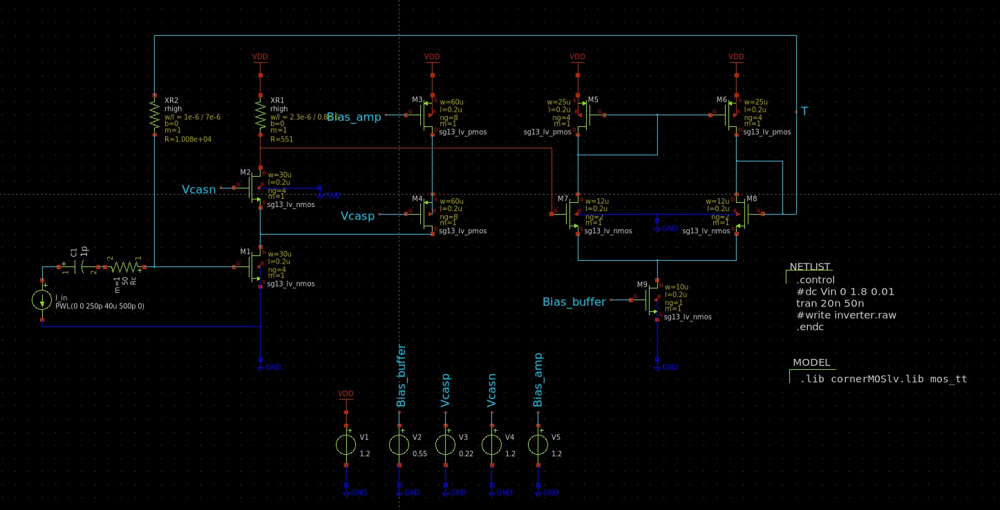
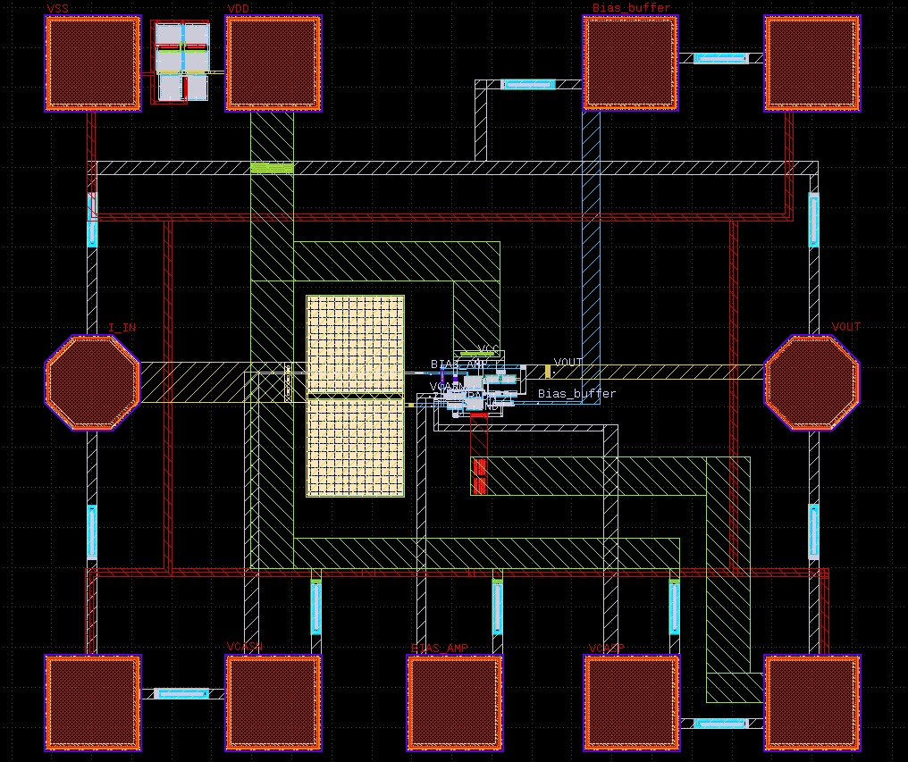

# Fast High Gain (FHG) Cascode TIA
-------------------------------
This document describes the design and specifications of a FHG Cascode TIA. This is a key component in radiation diode sensors and is used in various applications, such as medical radiology, luminosity and acceleration sensors.

The design was carried out with a focus on efficiency and performance, and includes the development of schematics, layout, and technical specifications. The following images illustrate the details of the circuit schematic, final layout and the main characteristics of the TIA.

## TIA's Schematic

## TIA's Layout

| **Parameter**                         | **Value**                 |
|---------------------------------------|---------------------------|
| **Frequency Range**                   | 6.0 GHz                   |
| **Supply Voltage (Vdd)**              | 1.2 mV                   |
| **Operating Temperature Range**       | 10-200°C                  |
