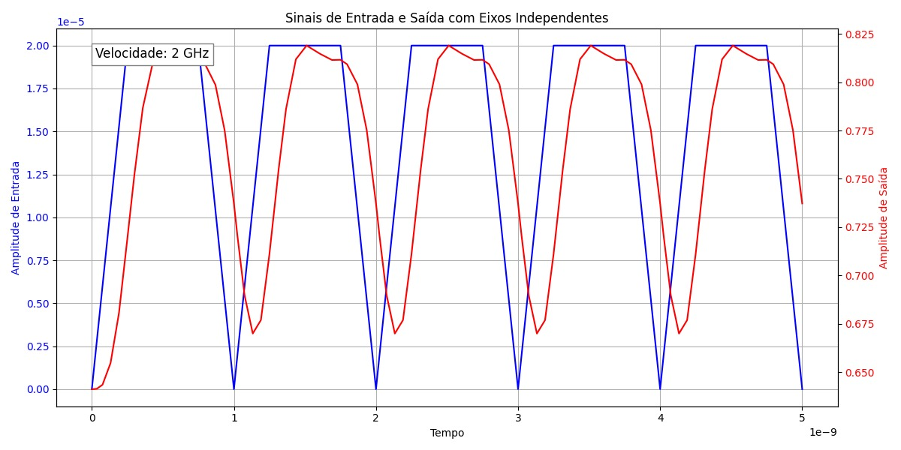

# Fast High Gain (FHG) Cascode TIA
-------------------------------
## Validation
The output signal of the FHG Cascode TIA (TIA) was simulated over time. The following graph illustrates the voltage response of the TIA over time at 2GHz.

This signal validates the expected behavior of the TIA under the specified operating conditions.
