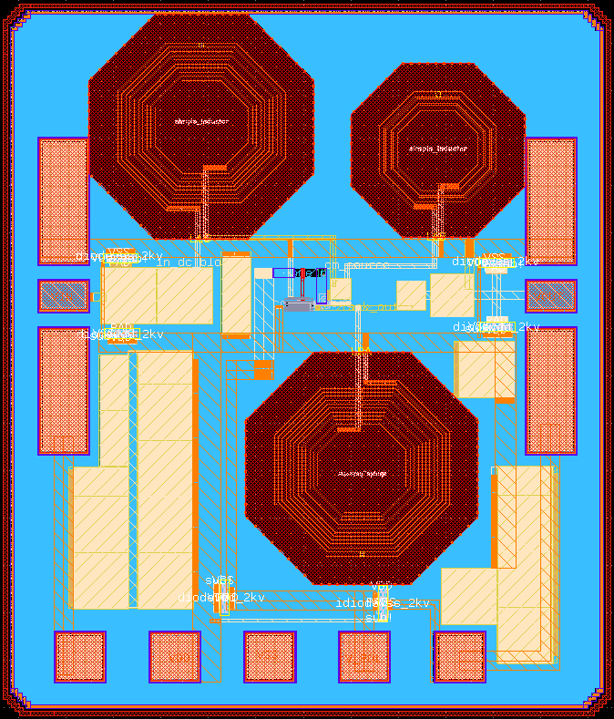

*******************************************************
Welcome to a LNA 2.45GHz Open Source PDK documentation!
*******************************************************

.. toctree::
    :hidden:
    
    specification
    designdata
    custom_components
    validation

This project doesn't have the ambition to produce a ground-braking LNA, but serves as a base for a tutorial to do Open Source analog design.
This tutorial is made by engineer student at INPG Phelma and will be used by upcoming students. However it is meant to be used by anyone.

The tutorial can be found here : `https://analog-course.readthedocs.io <https://analog-course.readthedocs.io>`_.

