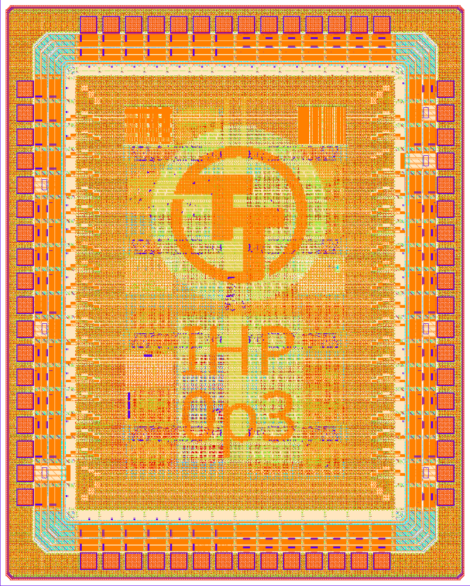
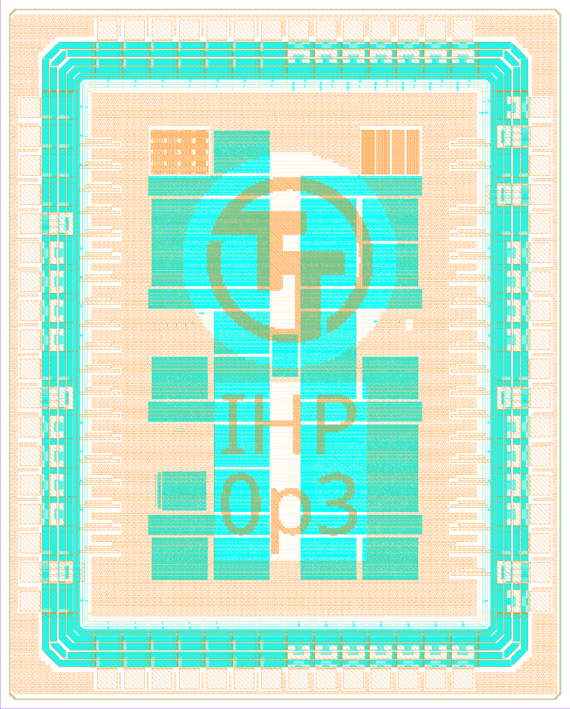
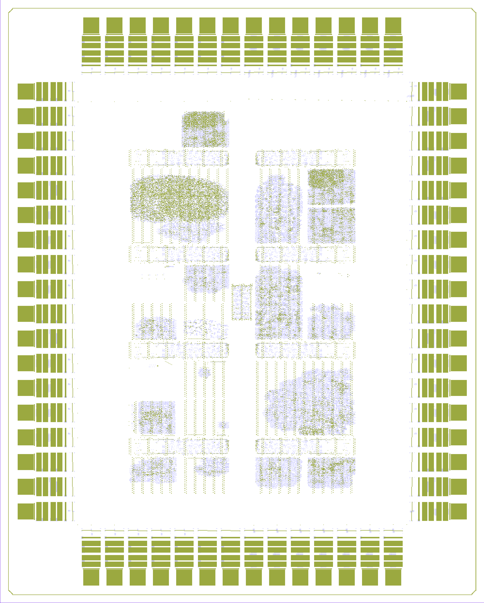

# Tiny Tapeout IHP 0p3

This is an experimental open source Tiny Tapeout shuttle.

The source files used to build the chip can be found in the following GitHub repository:

https://github.com/TinyTapeout/tinytapeout-ihp-0p3 (commit c2e736682747220a3a3086dc525365cd819c178c)

Additionally, an included PDF datasheet provides comprehensive documentation for all user projects featured on this Tiny Tapeout shuttle.

## Chip Renders

The renders below were generated using a [Python script](https://github.com/TinyTapeout/tinytapeout-chip-renders/blob/main/scripts/render.py) that uses the KLayout library.

### Full GDS

### Top Metal 1/2

### Logic Density (via1/via3)

